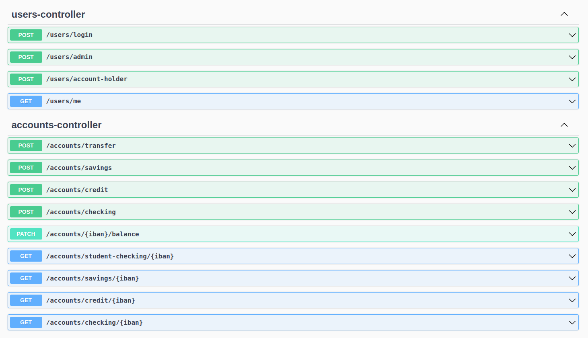
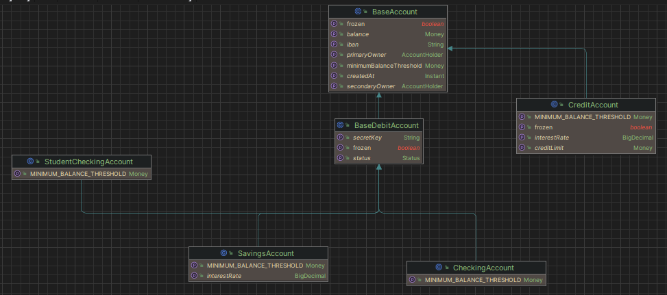
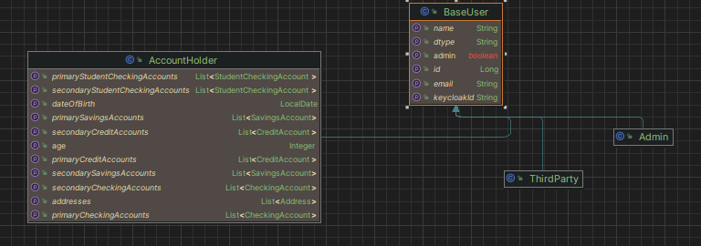

# Sergi Tubert - Ironbank
Ironbank is an open source Fintech alternative.

## Table of Contents
1. [Technologies](#technologies)
2. [Installation](#installation)
3. [Documentation](#documentation)

## Technologies
***
A list of technologies used within the project:
* [Spring boot](https://spring.io/): Version 2.7.3
* [MySQL](https://www.mysql.com/): Version 5.7
* [Keycloak](https://www.keycloak.org/): Version 19.0.1
* [Docker](https://www.docker.com/)

### Libraries
* [Iban4j](https://github.com/arturmkrtchyan/iban4j): Version 3.2.3
* [springdoc-openapi-ui](https://springdoc.org/): Version 1.6.4
## Installation
***
### Prerequisites
1. Install ```docker``` and ```docker-compose```
2. Check the installed version with ```docker -v``` and ```docker compose version```

### Set up
1. Inside the project root, run ```docker compose up -d```
2. If no keycloak realm has been configured, import keycloak realm configuration from ```src/main/resources/import-realm.json```
3. Run the java project

## Documentation
***
Once the project has been initialized, check the following routes for project documentation:
* To get a JSON-based OpenAPI specification: ```/v3/api-docs/```
* To get a interactive UI documentation: ```/swagger-ui/index.html#/```



### Class diagrams
#### Accounts

#### Users

